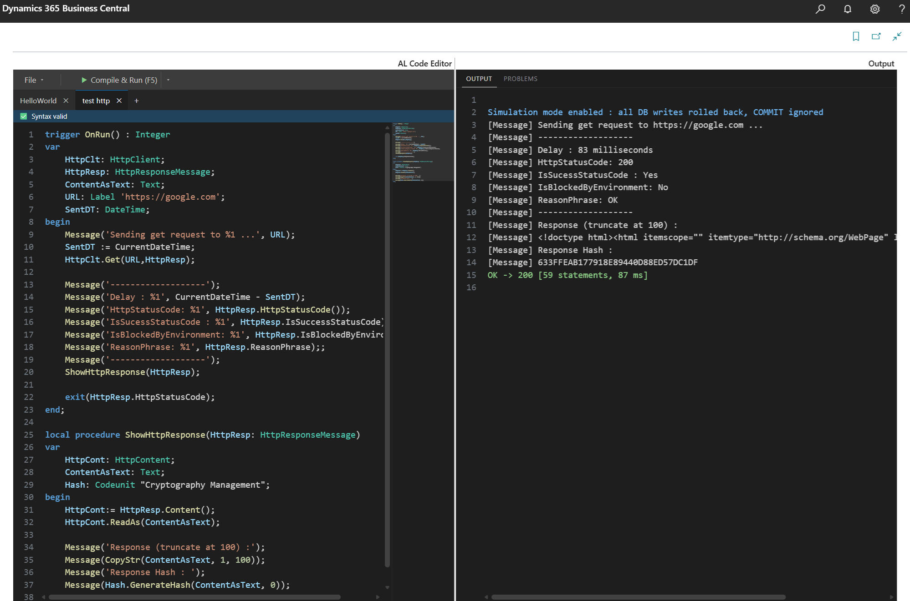
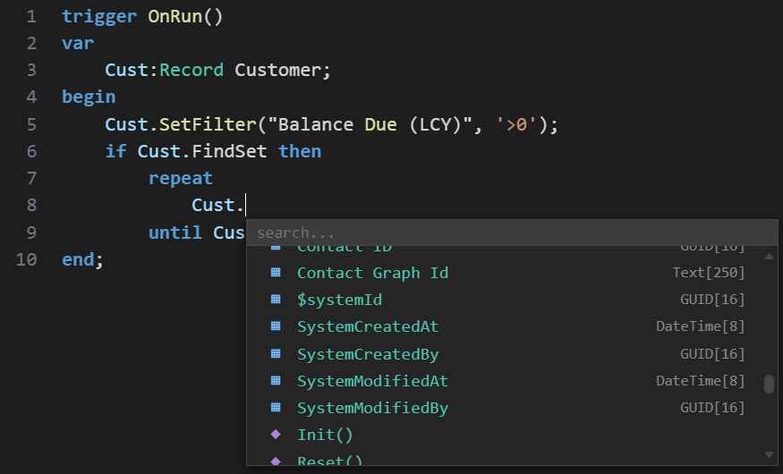
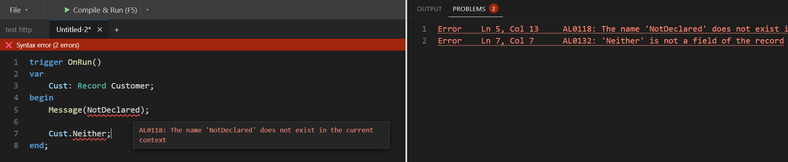
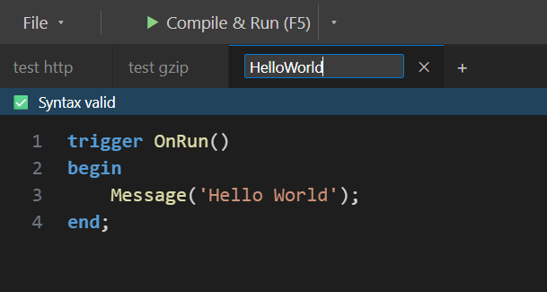
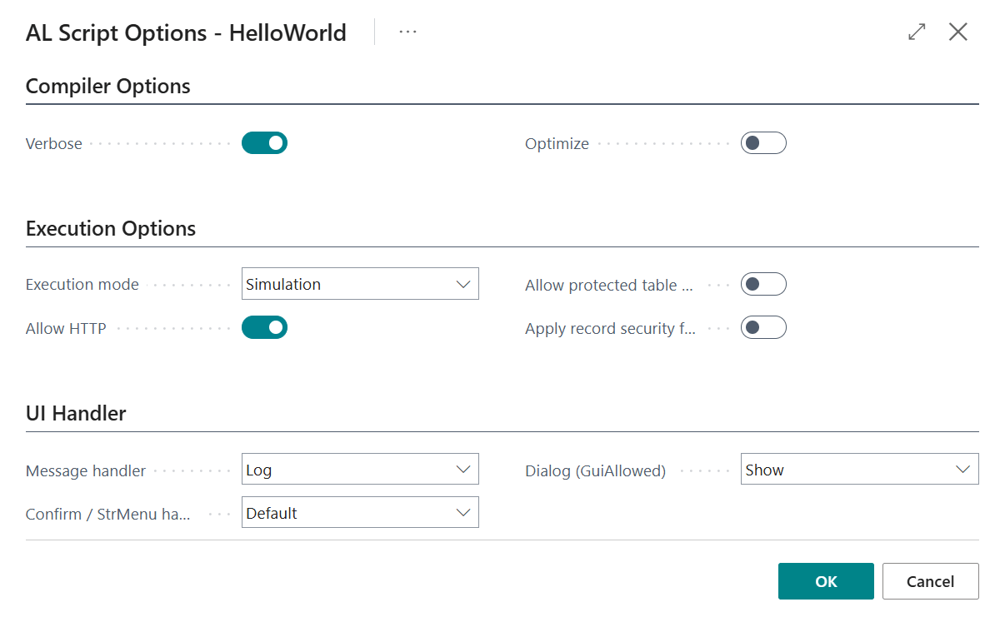

# AL Interpreter for Business Central

[](LICENSE.md)
[](https://github.com/MaximeCaty/AL-Interpreter/releases)
[](#install)
[](#6-cloud-vs-on-premise)

**Write AL and run it directly inside the Business Central web client.**
No VS Code, no container, no publish cycle — type code, press **F5**, read the result.



- **Safe on live data** — Enable *Simulation mode*, rolls back every record writes at the end of the run, even on success.
- **Behaves like native AL** — same compiler rules, same runtime semantics, table triggers and events run natively, user permissions apply.
- **Built for AI agents** — every error reported at once with line, and hint like "did you mean", so a model can self-correct.

Typical uses: one-off **data fixes**, **investigation** of a live environment, trying an **AL concept** without a dev setup, and a **sandbox for AI-generated AL**.

> ⚠️ runs **~10× slower than compiled AL** on pure logic (database work is native speed). It is a tool for scripts, fixes and investigation — not a replacement for extensions. See [Performance](#3-performance).

## Install

1. Download the latest `.app` from **[Releases](https://github.com/MaximeCaty/AL-Interpreter/releases)** — pick `Cloud_…` for SaaS / per-tenant, `OnPrem_…` for on-premise.
2. Publish it to a **sandbox** first (Extension Management, or `Publish-NAVApp` on-premise).
3. In the web client, search for page **"AL Script Editor"**.

Requires Business Central **27.0 or later**. No dependencies.

## Contents

1. [Live code editor](#1-live-code-editor)
2. [AI friendly](#2-ai-friendly)
3. [Performance](#3-performance)
4. [Supported features](#4-supported-features)
5. [Calling ALI from AL](#5-calling-ali-from-al)
6. [Cloud vs On-Premise](#6-cloud-vs-on-premise)
7. [Architecture](#7-architecture)
8. [Disclaimer & license](#8-disclaimer--license)

---

## 1. Live code editor

The **AL Script Editor** page brings a VS Code-like experience into the Business Central web client, combining a JavaScript control add-in with AL metadata.
Type AL, press **F5**, read the result.

### Autocompletion



*Completion reads your real tables, fields and procedures — not a static keyword list.* Builtin methods, record fields, procedures and variable declarations are suggested while typing in a searchable dropdown.

### Live syntax check



*Errors are checked against your actual database as you type, with "did you mean" hints.*
Real semantic checks — unknown tables, fields or procedures, wrong argument types, invalid `var` arguments — not just keyword coloring. Errors are underlined in place and listed in the **Problems** panel.

### Multi-tab



Several scripts can be open at once. A new tab is a scratch buffer; give it a name (click the tab title) and it becomes a stored script, auto-saved and reopenable from the script list.

### Compile & run options



| Option | Default | Effect |
|---|---|---|
| **Simulation / Normal** (toolbar toggle) | Simulation | Simulation rolls back every database write at the end, even on success — safe on live data. Normal commits. |
| Verbose | Off | Errors quote the source line with a caret and a plain-language hint |
| Optimize | Off | Precompute constant expressions, drop dead branches |
| Allow HTTP | Off | Permit outbound `HttpClient` calls |
| Allow protected table write | Off | Permit writes to posted documents, ledger entries and registers |
| Apply record security filters | Off | Script only sees records the user is allowed to see |
| Show record operation counts | Off | List insert/modify/delete counts per table after the run |
| Message handler | Log | Collect `Message()` in the result, or also show it as a real dialog |
| Confirm / StrMenu handler | Default | Scripted answer (otherwise `false` / `0` + warning), raise an error, or show the real dialog |
| Dialog (GuiAllowed) | Show | Real `GuiAllowed`, or always `false` to simulate a headless session |

The compiled script is cached with the stored script: an unchanged script re-runs without compiling. **Force run** (Ctrl+F5) recompiles, which you need after changing an object the script calls.

### Preprocessor symbols

> On-premise only. A cloud build cannot read published object AL source, so there is nothing for these symbols to apply to and the page is not shipped — see [Cloud vs On-Premise](#6-cloud-vs-on-premise).

When a script calls a procedure of an existing published object, ALI reads that object's AL source from the database and compiles it on the fly. If that source contains conditional compilation directives (`#if CLEAN25 ... #endif`, `#if not CLEAN24 ...`), ALI must know which symbols were defined when the extension was built.

The **Preprocessor** toolbar button opens a page where you declare these symbols **per published extension**. `#define` / `#undef` inside a file are always honored on top of this set.

---

## 2. AI friendly

Built to be driven by a small AI model, with secure defaults and output it can act on.

- **Safe by default** — Simulation mode lets an agent run code on real data without side effects. HTTP, protected-table writes and record security filtering (e.g. user responsibility center) are opt-in gates. The interpreter always inherits the user's permissions.
- **Errors built for self-correction** — all errors reported at once, with source line, caret, hint and "did you mean". Common C#/JavaScript slips (`==`, `&&`, `"text"`, `;` before `else`, `String`/`int`) get their AL spelling in the hint.
- **Warnings for classic mistakes** — e.g. reading a FlowField without `CalcFields`.
- **Callable from AL** — the public API ([section 5](#5-calling-ali-from-al)) lets your own extension compile and run a script, then read back messages, return value and errors as text or JSON. Wire it to an endpoint and an agent has a BC sandbox.

---

## 3. Performance

**Expect ~10× the run time of native AL** on typical business logic (loops, sub procedures, text and collection work).

Why: the interpreter itself is written in AL, so each script statement costs several real AL statements. Database work is *not* slowed down — reads, writes, filters and table triggers run natively and respect user permissions. The overhead sits on the surrounding logic; SQL-heavy scripts (a few large `FindSet` / `ModifyAll`) come much closer to native speed.

The **Benchmark** action on the options page measures this on your own data using the Customer table: the same workload (record read, text, char arithmetic, decimal, date, list, dictionary, sub procedure calls) runs as native AL and through ALI, both returning a matching checksum.

| Customers | Native AL | ALI | ALI compile | Ratio |
|---|---|---|---|---|
| 10 000 | 86 ms | 901 ms | 20 ms | ×10.5 |
| 100 000 | 768 ms | 8 833 ms | 17 ms | ×11.5 |

---

## 4. Supported features

The interpreter follows the native AL compiler (alc.exe) and the Business Central runtime. Written code is translated to bytecode that executes native AL statements wherever possible.

- ✅ supported, behaves exactly like native AL
- 🔶 recognized — compiles, but reports a "not implemented yet" error
- ❌ not supported

Reference: [AL data types and methods](https://learn.microsoft.com/en-us/dynamics365/business-central/dev-itpro/developer/methods-auto/library).

### 4.1 Data types

| Data type | Status | Notes |
|---|---|---|
| Integer, BigInteger, Decimal, Boolean, Byte, Char | ✅ | char arithmetic, `s[i]` read/write |
| Text / Text[n], Code[n], Label | ✅ | length enforced, Code upper-cased |
| Option, Enum | ✅ | `Enum::X::Y`, `Format` |
| System option types (`TextEncoding`, `DataScope`, `IsolationLevel`, `SecurityFilter`, `ClientType`, `TransactionType`, `DataClassification`, `ErrorType`, `PageStyle`, `Verbosity`, `FieldClass`, `FieldType`) | ✅ | as values and variable types |
| Date, Time, DateTime, Duration, DateFormula | ✅ | native arithmetic, `CalcDate`, `Evaluate` |
| Guid | ✅ | |
| Array (`array[N] of`) | ✅ | multidimensional, `ArrayLen` / `CopyArray` / `CompressArray` |
| Variant | ✅ | `Is*` predicates |
| Record, temporary Record | ✅ | table triggers and `OnValidate` run natively |
| RecordRef, FieldRef, KeyRef | ✅ | full native surface (§4.4) |
| RecordId | ✅ | |
| List of [T], Dictionary of [K,V] | ✅ | |
| TextBuilder, BigText, SecretText | ✅ | |
| InStream / OutStream, Blob fields | ✅ | optional `TextEncoding` |
| HttpClient & Http* family | ✅ | requires the *Allow HTTP* option (default off) |
| JsonObject / JsonArray / JsonToken / JsonValue | ✅ | |
| Xml* (all 16 types) | ✅ | |
| Dialog | ✅ | |
| Codeunit variables (`MyCU.Proc()`), `Codeunit.Run` | ✅ | procedures of your own codeunits are compiled on the fly; `Codeunit.Run` executes natively |
| Table & tableextension procedures (`Rec.MyProc()`) | ✅ | object global variables included |
| Event publishers / subscribers | ✅ | raising an event runs every active subscriber; the `IsHandled` pattern works |
| Native codeunits (Type Helper, Base64 Convert, Math, Encoding, Environment Information, Language, Cryptography Management, Data Compression, Temp Blob, Regex) | ✅ | called natively (§4.10) |
| IsolatedStorage | ✅ | `Set`, `SetEncrypted`, `Get`, `Contains`, `Delete`, all `DataScope` overloads. (refused in Simulation mode, §4.9) |
| Media / MediaSet fields | 🔶 | read ✅, import / insert / remove ❌ |
| ErrorInfo, File / FileUpload | 🔶 | |
| DotNet | ❌ | procedures using DotNet are blocked; the rest of the object still works |
| Page, Report, XmlPort, Notification, TestPage variables | ❌ | static `Page.Run` / `Report.Run` ✅ |
| Query | ❌ | a query's dataset (columns, joins) is not readable at runtime, and its source is unavailable to a cloud extension |
| TaskScheduler, Session, NavApp, ModuleInfo, FilterPageBuilder, NumberSequence, … | ❌ | |
| DataTransfer | ❌ | native AL allows it only in an upgrade codeunit, never at normal runtime |

### 4.2 Statements & language

All ✅:

- Assignment `:=`, compound `+=` `-=` `*=` `/=`
- `if/then/else`, `case` (value lists, ranges), `for/to/downto`, `while`, `repeat/until`, `foreach` (List, JsonArray, XmlNodeList, XmlAttributeCollection, Dictionary keys), `exit`, `break`
- All operators with native precedence; `and`/`or`/`xor` evaluated eagerly as in native AL
- Procedures: by-value and `var` parameters, recursion, overloading, named return values, paren-less calls (`MyProc;`, `x := Rec.Count`)
- Record parameters, by value and `var`, temporary records
- `[TryFunction]`, `GetLastErrorText`
- `Commit()`
- `System.` qualifier
- Implicit conversions: numeric, `Enum ↔ Option`, `Char → Text`
- Preprocessor directives `#if` / `#elif` / `#else` / `#endif`, `#define` / `#undef`
- `with` rejected (as with `NoImplicitWith`)

<details>
<summary><b>4.3 Record methods</b> — all supported except 5</summary>

All ✅ unless noted:

`Init`, `Reset`, `Insert`, `Modify`, `Delete`, `DeleteAll`, `ModifyAll`, `Rename`, `Truncate`, `Get` (incl. RecordId), `GetBySystemId`, `Find`, `FindFirst`, `FindLast`, `FindSet`, `Next`, `Count`, `CountApprox`, `IsEmpty`, `SetRange`, `SetFilter`, `GetFilter(s)`, `CopyFilter(s)`, `SetRecFilter`, `GetRangeMin/Max`, `GetView/SetView`, `GetPosition/SetPosition`, `HasFilter`, `FilterGroup`, `SetCurrentKey`, `CurrentKey`, `Ascending`, `KeyCount`, `CalcFields`, `CalcSums`, `SetAutoCalcFields`, `SetLoadFields`, `AddLoadFields`, `LoadFields`, `AreFieldsLoaded`, `Copy`, `TransferFields`, `Validate`, `TestField`, `FieldError`, `Mark`, `ClearMarks`, `MarkedOnly`, `LockTable`, `ReadIsolation`, `ReadConsistency`, `RecordLevelLocking`, `SecurityFiltering`, `SetPermissionFilter`, `ReadPermission/WritePermission`, `ChangeCompany`, `CurrentCompany`, `IsTemporary`, `RecordId`, `TableName`, `TableCaption`, `FieldName`, `FieldCaption`, `FieldCount`, `FieldExist`, `AddLink`, `DeleteLink(s)`, `CopyLinks`, `HasLinks`.

❌ `FieldActive`, `FieldNo`, `Relation`, `Consistent`, `SetBaseLoadFields`.

**Record security** (option): every table read is restricted to the records the user is allowed to see; the script cannot remove these filters.

</details>

<details>
<summary><b>4.4 RecordRef / FieldRef / KeyRef</b> — full surface</summary>

- **RecordRef** ✅ — `Open` (by id or by table name), `Close`, `Number`, `Name`, `Caption`, `GetTable`, `SetTable`, `Duplicate`, `Field` (by number or name), `FieldIndex`, `KeyIndex`, `FieldExist`, `System*No`, plus every Record method above and the field-number forms (`SetRange`, `SetFilter`, `Validate`, `CalcFields`, `SetLoadFields`, …).
- **FieldRef** ✅ — `Value` (get/set), `Validate`, `SetRange`, `SetFilter`, `GetFilter`, `GetRangeMin/Max`, `CalcField`, `CalcSum`, `TestField`, `FieldError`, `Name`, `Number`, `Caption`, `Length`, `Active`, `Relation`, `Class`, `Type`, `OptionCaption`, `OptionMembers`, enum helpers, `IsOptimizedForTextSearch`, `Record`. `Value` on Blob / Media fields ❌.
- **KeyRef** ✅ — `Active`, `FieldCount`, `FieldIndex`, `Record`.
- Chaining works: `RRef.Field(3).Value := x`, `RRef.KeyIndex(1).FieldIndex(1).Name`.

</details>

<details>
<summary><b>4.5 Text</b> — full surface</summary>

✅ `CopyStr`, `StrLen`, `MaxStrLen`, `StrPos`, `StrSubstNo`, `Format`, `LowerCase`, `UpperCase`, `DelChr`, `ConvertStr`, `PadStr`, `IncStr`, `SelectStr`, `Evaluate`, `DelStr`, `InsStr`, `StrCheckSum`, and the instance methods `Contains`, `StartsWith`, `EndsWith`, `IndexOf`, `LastIndexOf`, `IndexOfAny`, `Replace`, `Split`, `Substring`, `ToLower`, `ToUpper`, `Trim`, `TrimStart`, `TrimEnd`, `PadLeft`, `PadRight`, `Remove`, `s[i]`.

</details>

<details>
<summary><b>4.6 Collections & builders</b> — List, Dictionary, TextBuilder, BigText, SecretText, Media</summary>

- **List** ✅ `Add`, `AddRange`, `Get`, `Set`, `Count`, `Contains`, `IndexOf`, `Insert`, `Remove`, `RemoveAt`, `RemoveRange`, `GetRange`, `Reverse` — ❌ `ToArray`
- **Dictionary** ✅ `Add`, `Set`, `Get`, `ContainsKey`, `Remove`, `Count`, `Keys`, `Values`
- **TextBuilder** ✅ full surface
- **BigText** ✅ `AddText`, `GetSubText`, `Length`, `TextPos`, `Read`, `Write`
- **SecretText** ✅ `IsEmpty`, `Unwrap`, `SecretStrSubstNo`
- **Media / MediaSet** ✅ `MediaId`, `HasValue`, `ExportStream`, `Count`, `Item` — ❌ `ImportStream`, `Insert`, `Remove`

</details>

<details>
<summary><b>4.7 Streams</b></summary>

✅ `WriteText`, `WriteLine`, `ReadText`, `Write`, `Read` (typed binary I/O), `EOS`, `Length`, `Position`, `ResetPosition`, `CopyStream`.

</details>

<details>
<summary><b>4.8 HTTP, JSON, XML</b> — full surface</summary>

- **Http** ✅ `HttpClient` (`Get`, `Post`, `Put`, `Delete`, `Send`, `SetBaseAddress`, `Timeout`, `DefaultRequestHeaders`), `HttpRequestMessage`, `HttpResponseMessage`, `HttpContent`, `HttpHeaders`. Certificates / auth helpers ❌.
- **Json** ✅ full `JsonObject` / `JsonArray` / `JsonToken` / `JsonValue` surface, typed getters included (`GetText`, `GetInteger`, `GetObject`, …), `SelectToken`, `Clone`, `Keys`. JsonArray stays 0-based like native.
- **Xml** ✅ full documented surface of all 16 Xml types: create / read / write (text and streams), XPath `SelectNodes` / `SelectSingleNode` with namespaces, attributes, navigation.

</details>

<details>
<summary><b>4.9 System functions</b></summary>

| ✅ | 🔶 | ❌ |
|---|---|---|
| `Abs`, `Round`, `Power`, `Random`, `Randomize`, `Today`, `Time`, `CurrentDateTime`, `WorkDate`, `CalcDate`, `Date2DMY`, `Date2DWY`, `DMY2Date`, `DWY2Date`, `CreateDateTime`, `DT2Date`, `DT2Time`, `ClosingDate`, `NormalDate`, `RoundDateTime`, `Evaluate`, `Format`, `Clear`, `ClearAll`, `GetLastErrorText`, `ClearLastError`, `GetLastErrorCallStack`, `ArrayLen`, `CopyArray`, `CompressArray`, `Message`, `Error`, `Confirm`, `StrMenu`, `Sleep`, `GuiAllowed`, `CompanyName`, `UserId`, `UserSecurityId`, `SessionId`, `CreateGuid`, `IsNullGuid`, `GetUrl`, `GlobalLanguage`, `WindowsLanguage`, `SelectLatestVersion`, `CurrentClientType`, `CurrentExecutionMode`, `CopyStream`, `Variant2Date`, `Variant2Time`, `DaTi2Variant`, `Codeunit.Run`, `Page.Run`, `Report.Run`, `DownloadFromStream`, `UploadIntoStream`, `IsolatedStorage.*`, `Database::` / `Codeunit::` / `Enum::` ids | `CurrReport`, `CurrPage`, `CurrFieldNo`, `Hyperlink`, `LogMessage`, `FeatureTelemetry`, `Download`, `Upload`, `FileExists`, `ErrorInfo` | Encryption functions, error-collection functions, `IsNull`, `GetDotNetType`, `ApplicationPath`, `TemporaryPath`, `CaptionClassTranslate`, `GetDocumentUrl` |

`Message` / `Error` are captured in the run result; `Confirm` / `StrMenu` answers can be scripted.

**IsolatedStorage** — `Set`, `SetEncrypted`, `Get`, `Contains`, `Delete`, each with and without a `DataScope` (`Module`, `Company`, `User`, `CompanyAndUser`). `Set` / `SetEncrypted` take a `SecretText` as well as a `Text`, and `Contains` supports the `Contains(Key, DataScope, var IsSecret)` overload.

> ⚠️ In **Simulation mode** the three writing methods (`Set`, `SetEncrypted`, `Delete`) raise a runtime error instead of running: isolated storage is written outside the record transaction ALI rolls back, so the change would survive a run that is supposed to leave no trace. Reads stay available. Run in *Normal* mode to write.

</details>

<details>
<summary><b>4.10 Native codeunits</b> — Type Helper, Regex, Math, Base64, …</summary>

These system codeunits are called on the real object, so their DotNet-based implementation works:

| Codeunit | Coverage |
|---|---|
| Type Helper | URL/HTML encoding, date/decimal formatting, UTC helpers, `IsNumeric`, `TextDistance`, bitwise ops, … |
| Base64 Convert | `ToBase64`, `ToBase64Url`, `FromBase64` (all overloads) |
| Math | all procedures |
| Encoding | `Convert` |
| Data Compression | ZIP and GZip (create, open, extract, add, remove entries) |
| Temp Blob | streams, `HasValue`, `Length`, from/to record and field |
| Environment Information | `IsProduction`, `IsSandbox`, `IsSaaS`, `IsOnPrem`, environment name / settings, … |
| Language | language / culture lookups and overrides |
| Cryptography Management | hashing, keyed hashes, `SignData`, `VerifyData` |
| Regex | `IsMatch`, `Match`, `Replace`, `Split`, `Escape`, groups & captures |

</details>

### 4.11 Diagnostics

- All errors reported at once, with line and column
- Verbose mode: source line, caret and hint under each error; runtime errors explain 1-based vs 0-based indexes, missing dictionary keys, …
- "Did you mean" for unknown methods, fields, tables and codeunits
- No error cascade after an unknown call
- Warning for a FlowField read without `CalcFields`
- Error codes can be hidden for cleaner output

---

## 5. Calling ALI from AL

Embed ALI in your own extension (AI tool, job queue, custom page) with three codeunits. Full API reference: [docs/Calling-ALI-from-AL.md](docs/Calling-ALI-from-AL.md).

```al
procedure RunScript(Source: Text): Text
var
    Engine: Codeunit "ALI Engine";          // 51111 - compile & run
    RunOptions: Codeunit "ALI Run Options"; // 51116 - how the script runs
    Result: Codeunit "ALI Exec Result";     // 51112 - outcome
begin
    RunOptions.Reset();                                          // start from defaults
    RunOptions.SetMode("ALI Exec Mode"::Simulation.AsInteger()); // roll back every DB write
    Engine.SetVerbose(true);                                     // errors quote source line + hint

    Engine.CompileAndRun(Source, Result);
    exit(Result.ToText());   // 'OK -> 42 [12 statements, 3 ms]' or 'ERROR(3,5): ...'
end;
```

`Source` can be plain statements (`Message('Hello');`), a set of procedures, or a full `codeunit 50000 X { ... }`. The entry point is `trigger OnRun()`, else the **first declared procedure**; its return value comes back in `Result.ResultText()`.

**More control**

| Goal | Call |
|---|---|
| See every compile error / warning before running | `Engine.Compile(Source, Diags)` then `Engine.RunCompiled(Result)`; `Diags.ToText()` or `ToJson()` |
| Read the outcome | `Result.Succeeded()`, `ResultText()`, `ErrorMessage()` + `ErrorLine()`, `GetCollectedMessage(i)`, `DurationMs()` |
| Skip compilation on later runs | `Engine.SaveCompiled()` → store the text → `Engine.LoadCompiled(Text)` → `RunCompiled` |
| Syntax check as you type | `Engine.CheckDiagnostics(Source, Diags)` |
| Faster first run | `Engine.Warmup()` once per session (~600 ms → ~130 ms) |

**Run options** (`ALI Run Options`, set before running; defaults in **bold**)

| Setter | Values |
|---|---|
| `SetMode` | **Normal**: writes persist · `Simulation`: every write rolled back, `COMMIT` ignored, `IsolatedStorage` writes refused |
| `SetMessageMode` | **Log**: `Message()` collected in `Result` · `Show`: collected and displayed |
| `SetDialogMode` | **Show**: real `GuiAllowed` · `Hide`: `GuiAllowed = false`, dialogs skipped |
| `SetInteractionMode` | **Default**: scripted answer, else `false` / `0` + warning · `Error`: unscripted = runtime error · `Show`: real dialog |
| `QueueConfirmAnswer(Boolean)`, `QueueStrMenuAnswer(Integer)` | Scripted answers, consumed in order; `SetDefaultConfirmAnswer` / `SetDefaultStrMenuAnswer` for the rest |
| `SetAllowHttp`, `SetAllowProtectedWrite`, `SetApplyRecordSecurity` | Security gates, all **false**: `HttpClient` calls, writes to posted documents / ledgers, record security filters on reads |
| `SetStatementBudget(Integer)` | Abort runaway scripts (**10M** statements) |
| `SetVerbose`, `SetHideDiagCodes` | Detailed error text · drop `ALI1234:` prefixes (handy when an LLM reads them) |

**Pitfalls**

- `ALI Engine` and `ALI Run Options` are **`SingleInstance`**: settings leak between callers (Script Editor, AI tool, you). Call `RunOptions.Reset()` and every `Engine.Set*` you rely on before each run.
- Starting a run **commits the caller's pending writes**, in both modes.
- Default entry point is the first declared procedure: declare it before helpers, or use `Engine.SetRequireOnRun(true)` to demand `trigger OnRun()`.
- Reference caller: the Script Editor page, [`ALIScriptEditor.Page.al`](AL-Interpreter/ALCodeEditor/ALIScriptEditor.Page.al).

---

## 6. Cloud vs On-Premise

Both builds are available on the [Releases](https://github.com/MaximeCaty/AL-Interpreter/releases) page.

### What a cloud build cannot do

Everything the interpreter does on its own (whole supported feature surface of [chapter 4](#4-supported-features)) — is identical in both flavors. What differs is anything that has to read **the AL source of an already published object**, eg calling a record procedure, which require access on table `Application Object Metadata`. That table's scope is `OnPrem`.

| Feature | On premise | Cloud |
|---|---|---|
| Calls into existing objects (`Cust.MyProc()`, `MyCU.MyProc()`) | yes | no — reported as ALI961, naming the reason |
| Member names / captions of a standalone **Enum object** | yes | no — the existing ALI987 gate; integer enum semantics still work |
| Enum and option **fields** of a table | yes | yes — read through `FieldRef`, not through source |
| Procedures of existing objects in the completion dropdown | yes | not offered (the compiler cannot resolve them either) |
| Preprocessor Symbols page | yes | not shipped |
| `GetLastErrorObject()` | yes | ALI982 at compile time |
| `EnvironmentInformation.GetEnvironmentSetting()` | yes | ALI982 at compile time |

`ALI982` cases are real AL methods whose own scope is `OnPrem`; they stay in the builtin catalogue in both flavors (so every `BuiltinId` — which serialized bytecode carries raw — is identical across builds) and are refused at bind time with the reason, rather than silently missing.

### Building from source

One source tree, built two ways. The flavor is chosen entirely in [`app.json`](AL-Interpreter/app.json) — `target` plus two preprocessor symbols — and nothing else in the repository needs touching.

| Symbol | Defined when | Effect |
|---|---|---|
| `CLOUD` | building for a cloud (SaaS / per-tenant) installation | Excludes everything that depends on OnPrem-scoped platform surface |
| `TEST` | building a test run | Includes everything under [`Test/`](AL-Interpreter/Test/) |

| Flavor | `target` | `preprocessorSymbols` | `dependencies` |
|---|---|---|---|
| On premise, development | `OnPrem` | `["TEST"]` | Library Assert |
| On premise, release | `OnPrem` | `[]` | *(empty)* |
| Cloud, development | `Cloud` | `["CLOUD", "TEST"]` | Library Assert |
| Cloud, release | `Cloud` | `["CLOUD"]` | *(empty)* |

`app.json` as committed is the **cloud release** build (`"target": "Cloud"`, `"preprocessorSymbols": ["CLOUD"]`). For development, add `TEST` so F5 and the test runner work.

`TEST` exists so a public release ships without the test codeunits and therefore without the dependency on Microsoft's **Library Assert**, which is not installed by default. Drop `TEST` from `preprocessorSymbols` *and* empty `dependencies` together — the symbol removes the code, the manifest removes the requirement.

---

## 7. Architecture

ALI is a classic compiler pipeline followed by a register-based bytecode interpreter, all in AL. This section explains the general principles; the source is the detailed reference.

### Folder layout

All source lives under [`AL-Interpreter/`](AL-Interpreter/):

| Folder | Content |
|---|---|
| [`Foundation/`](AL-Interpreter/Foundation/) | Shared enums (`TokenKind`, `NodeKind`, `Opcode`, `TypeKind`, run modes…), token table, diagnostics bag, capacity constants (`ALI Limits`) |
| [`Frontend/`](AL-Interpreter/Frontend/) | Lexer, parser, flat AST store, preprocessor symbols |
| [`Semantic/`](AL-Interpreter/Semantic/) | Binder, symbol table, type rules, builtin and object registries, record & option metadata, optimizer passes |
| [`Runtime/`](AL-Interpreter/Runtime/) | Engine facade, run options, exec result, lowerer, module, interpreter and per-family runtimes (Record, Json, Xml, Http, List, Dictionary, Stream, native codeunits…) |
| [`ALCodeEditor/`](AL-Interpreter/ALCodeEditor/) | Script Editor page + control add-in (live diagnostics, API catalog, options page, preprocessor symbols page) |
| [`StoredALScript/`](AL-Interpreter/StoredALScript/) | `ALI Stored Script` table (source + stored bytecode) and list page |
| [`Test/`](AL-Interpreter/Test/) | Test codeunits per pipeline stage and test objects (tables, pages, events) |

### 7.1 Compilation pipeline

```
Source
 → Lexer        → Token table + diagnostics
 → Parser       → Flat AST + diagnostics
 → Binder       → Symbols, types, register slots + diagnostics
 → Optimizer    → Rewritten AST (optional)
 → Lowerer      → Module (typed register bytecode)
 → Interpreter  → Exec result
```

- `Compile` runs the full pipeline and keeps the Module for `RunCompiled`. `CheckDiagnostics` stops after the binder. `SaveCompiled` / `LoadCompiled` serialize the Module as JSON.
- Stages communicate through flat data stores (codeunits passed by `var`). Diagnostics are collected, never thrown at the first error.
- Execution runs **lowered bytecode, not the AST**: compile heavy, run fast.
- Calls to real AL objects (codeunits, tables, events) are resolved by the [`ALI Object Registry`](AL-Interpreter/Semantic/ALIObjectRegistry.Codeunit.al), which reads the object's source from the database and compiles it together with the script.

### 7.2 Core representation: struct-of-arrays

AL has no heap objects or pointers, so every structure — tokens, AST nodes, symbols, instructions — is a set of **parallel arrays indexed by integer handles**. At compile time these are `List of [T]`; at run time they are fixed arrays, sealed when the Module is loaded. Enums such as `TokenKind`, `NodeKind` and `Opcode` are dense, append-only ordinals, which keeps serialized modules stable across versions.

### 7.3 Lexer

[`Frontend/ALILexer.Codeunit.al`](AL-Interpreter/Frontend/ALILexer.Codeunit.al) — single-pass scanner producing a token table (`Kind`, `Pos`, `Len`, `Line`, `Col`, `ValueIdx`) with separate literal pools. Identifiers are interned case-insensitively to integer ids, so nothing after the lexer compares strings. Preprocessor directives are resolved here, using the symbols declared for the object's extension.

### 7.4 Parser

[`Frontend/ALIParser.Codeunit.al`](AL-Interpreter/Frontend/ALIParser.Codeunit.al) and companions — recursive descent producing a flat AST (each node: `Kind`, `Token`, `FirstChild`, `ChildCount`, `Extra`). Expressions use Pratt parsing with native AL precedence, including the if/else semicolon rule. Error recovery (token insertion + resync) lets the parser report several errors per pass. A nesting-depth guard prevents AL stack overflow.

### 7.5 Binder

[`Semantic/ALIBinder.Codeunit.al`](AL-Interpreter/Semantic/ALIBinder.Codeunit.al) — single pass over the AST resolving symbols, types, conversions and register slots. Type rules mirror the native operator matrix; a builtin registry describes the whole AL surface (with partial implementations reporting "not implemented"); metadata oracles resolve tables, fields and enums at bind time. The AST stays immutable: the binder writes parallel annotation columns (`TypeOrd`, `SymbolId`, `ConvOrd`, `SlotIndex`). After binding, **no type or name resolution happens at run time**.

Methods on built-in types (Record, RecordRef, Json, Xml, Http, List, …) are dispatched by family: each family owns a range of negative symbol ids, and the lowerer maps them to family-specific opcodes. Calls on native system codeunits (Type Helper, Regex, …) bind to builtin rows and are executed on the real codeunit.

Events need no runtime machinery: when an object is read from the database, each event publisher's empty body is rewritten into direct calls to its active subscribers, so raising an event is an ordinary procedure call.

### 7.6 Optimizer (optional)

[`Semantic/Optimizer/`](AL-Interpreter/Semantic/Optimizer/) — AST-to-AST passes selected through an enum + interface: constant folding, constant propagation, dead-branch elimination. Enabled with `SetOptimize(true)`.

### 7.7 Lowerer and module

[`Runtime/ALILowerer.Codeunit.al`](AL-Interpreter/Runtime/ALILowerer.Codeunit.al), [`Runtime/ALIModule.Codeunit.al`](AL-Interpreter/Runtime/ALIModule.Codeunit.al) — transform the AST into register-based bytecode. The Module holds instruction columns (`Op, A, B, C`), typed constant pools, a procedure table, an operand pool for variadic operations and a debug map (PC → source line/column) used for runtime error positions.

### 7.8 Interpreter

[`Runtime/ALIInterpreter.Codeunit.al`](AL-Interpreter/Runtime/ALIInterpreter.Codeunit.al), delegating to `Runtime/ALI*Runtime.Codeunit.al` per family.

- Typed registers (Int, Decimal, Text, Boolean, handles…), fixed arrays, no boxing where avoidable.
- A statement budget (100M) stops runaway loops with error `ALI950`.
- **Transaction scope**: a run is a conditional `Codeunit.Run` on the interpreter itself, the only AL construct that gives it its own rollback scope. In Simulation mode the loop runs with commits ignored and a clean run ends with a sentinel error that forces the rollback, then reports success.
- `[TryFunction]` calls re-enter the execution loop natively from a try function, so a failing callee unwinds only its own frames and the script's `GetLastErrorText` is set.

### 7.9 Performance model

- Everything is an integer after lexing: ids, slots, types, opcodes. No string comparison in the hot path.
- No dynamic allocation while running; all state is pre-sized when the Module is loaded.
- Register VM rather than AST walking; all metadata and type resolution done at compile time.
- **Hot opcodes are inlined in the execution loop.** An AL procedure call costs far more than the work it usually wraps, so the most frequent operations live directly in the loop instead of helper procedures. This brought the ratio from about ×30 to about ×11 vs native, at the price of a large and deliberately ugly main loop.
- Room is left: inlining everything and merging all runtime codeunits into one would come closer still to native speed. Not done on purpose — it would be tens of thousands of lines in a single unmaintainable codeunit.

### 7.10 Guarantees

- Near-native AL semantics on the supported surface
- Deterministic diagnostics: every error reported at once, never just the first
- Serializable intermediate representations (stored compiled scripts)
- Each pipeline stage testable in isolation (see [`Test/`](AL-Interpreter/Test/))

---

## 8. Disclaimer & license

This app was designed and mostly developed with Anthropic Claude (Fable 5.1 and Opus 5). Despite extensive test coverage, bugs may exist — **always try a script on a sandbox before running it on production.**

Free and open source under the [GPL-3.0 license](LICENSE.md).
Bug reports, feature requests and feedback are welcome in [Issues](https://github.com/MaximeCaty/AL-Interpreter/issues).
